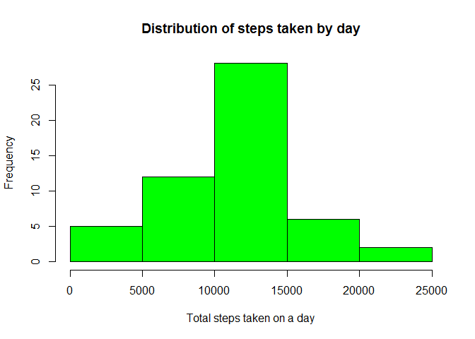
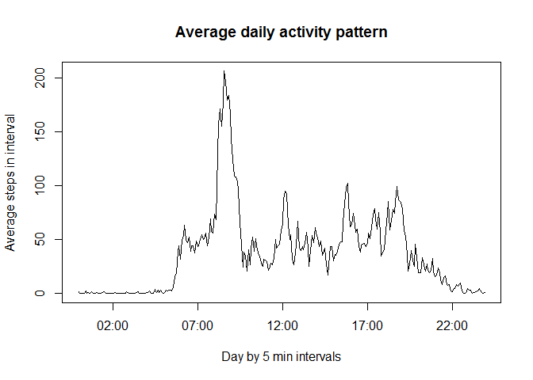
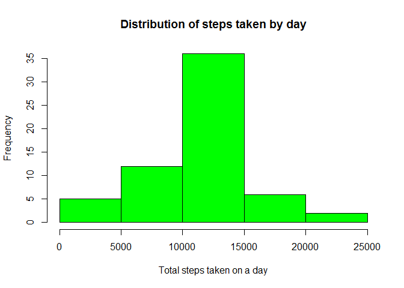
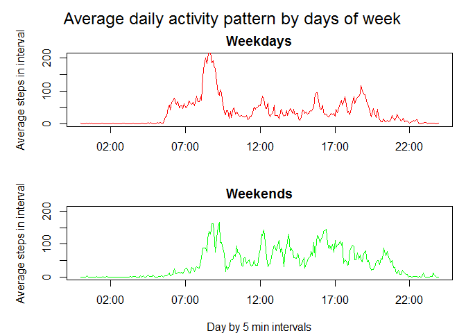

# Reproducible Research: Peer Assessment 1
## Loading and preprocessing the data

First I read in the data from the .csv, and format it by specifying date as a date type variable, and making an interval2 vector in the dataframe for plotting purposes. (It also needed a little trick: i have to force the interval variable in a 4 digit format: eg. 0220 equals 02:00 AM)  


```r
setwd("C:/Users/Ocs/Documents/Coursera/RR_CP1")
data <- read.csv("activity.csv", header=TRUE, sep=",", na.strings="NA")
data$date<-as.Date(data$date, format="%Y-%m-%d")
data$interval[as.numeric(data$interval)<10]<-paste("0",as.character(data$interval[as.numeric(data$interval)<10]),sep="")
data$interval[as.numeric(data$interval)<100]<-paste("0",as.character(data$interval[as.numeric(data$interval)<100]),sep="")
data$interval[as.numeric(data$interval)<1000]<-paste("0",as.character(data$interval[as.numeric(data$interval)<1000]),sep="")
data$interval2<-as.POSIXlt(paste(as.character(data$date),data$interval,"00"), format="%Y-%m-%d %H %M %S", origin="0000")
```


## What is mean total number of steps taken per day?

I generated a new data table by the aggregate command, which consits of the different dates and the total daily number of steps, which is the sum of the intervals. The distribution can be shown on a histogram like this. 


```r
steps_by_day<-aggregate(data$steps, list(date=data$date), sum, na.rm=FALSE)
hist(steps_by_day$x,col = "green",xlab = "Total steps taken on a day", main="Distribution of steps taken by day")
```

 
    
It looks like a nice normal distribution. Check its mean and median.


```r
mean(steps_by_day$x, na.rm=TRUE)
```

```
## [1] 10766.19
```

```r
median(steps_by_day$x, na.rm=TRUE)
```

```
## [1] 10765
```

We can see that the mean (10766.1) is really close to the median (10765), which signals that the distribution is indeed symmetric.

## What is the average daily activity pattern?

To discover tha daily activites pattern, I have to aggregate again, but now by the intervals.
(Which again I formatted to time format)  
The following graph shows the results of ploting the AVERAGE of steps against the 5 minute intervals
of a day.  

The pattern is really nice, az night people sleep, then they wake up, go to work in "rush hour", but in the afternoon there is no such peak as people go home at different times. 


```r
steps_by_time<-aggregate(data$steps, list(interval=data$interval), mean, na.rm=TRUE)
steps_by_time$interval2<-as.POSIXlt(paste(steps_by_time$interval,"00"), format="%H %M %S", origin="0000")
plot(steps_by_time$interval2,steps_by_time$x,type="n",xlab = "Day by 5 min intervals", ylab="Average steps in interval", main="Average daily activity pattern")
lines(steps_by_time$interval2,steps_by_time$x)
```

 


The 5 minute period where average steps peak starts at the following time:


```r
substr(steps_by_time$interval2[steps_by_time$x==max(steps_by_time$x)],12,16)
```

```
## [1] "08:35"
```

## Imputing missing values


```r
c(sum(is.na(data$steps)),sum(is.na(data$date)),sum(is.na(data$interval)))
```

```
## [1] 2304    0    0
```

These figures show the number of missing values of the original variables: steps, date and interval (in this order). As we can see there is no structural hole, so the time variables are present in each row, only the measured values are missing in several (thousand) cases. 

I correct this by replacing the "NA" values with the daywise average of the given period, by the following code: 


```r
data$steps[is.na(data$steps)]<-rep(steps_by_time$x,61)[is.na(data$steps)]
```

We can not see real significant changes in the histogram, but it got slightly pointier. (Higher kurtosis)


```r
steps_by_day_c<-aggregate(data$steps, list(date=data$date), sum, na.rm=FALSE)
hist(steps_by_day_c$x,col = "green",xlab = "Total steps taken on a day", main="Distribution of steps taken by day")
```

 

But checking the corrected means (first number) against the original (second), we can see that the average have not changed. It is quite trivial, as we added values representing average values.


```r
c(mean(steps_by_day_c$x, na.rm=TRUE),mean(steps_by_day$x, na.rm=TRUE))
```

```
## [1] 10766.19 10766.19
```

The median although have moved forward the mean (almost equal), but this is also expected, as we added a lot of "central" values.


```r
c(median(steps_by_day_c$x, na.rm=TRUE),median(steps_by_day$x, na.rm=TRUE))
```

```
## [1] 10766.19 10765.00
```

## Are there differences in activity patterns between weekdays and weekends?

To answer this question, first I have constructed a factor variable to differentiate weekdays and weekends. (I changed my location in order to make the code understandable.)


```r
Sys.setlocale("LC_TIME", "English")
```

```
## [1] "English_United States.1252"
```

```r
data$wd<-0
data$wd[weekdays(data$date)=="Sunday" | weekdays(data$date) == "Saturday"]<-1
data$wd<-factor(data$wd,labels=c("Weekday","Weekend"))
```

Then I created two aggregated databases in a similar way like earlier. (But now on the two subsets.)

```r
steps_by_time_wd<-aggregate(data$steps[data$wd=="Weekday"], list(interval=data$interval[data$wd=="Weekday"]), mean, na.rm=TRUE)
steps_by_time_wd$interval2<-as.POSIXlt(paste(steps_by_time_wd$interval,"00"), format="%H %M %S", origin="0000")

steps_by_time_we<-aggregate(data$steps[data$wd=="Weekend"], list(interval=data$interval[data$wd=="Weekend"]), mean, na.rm=TRUE)
steps_by_time_we$interval2<-as.POSIXlt(paste(steps_by_time_we$interval,"00"), format="%H %M %S", origin="0000")
```

And finally I make a panel of plots of the two subgroups. 


```r
par(mfrow=c(2,1), mar=c(4,5,2,1), oma=c(0,0,2,0))
plot(steps_by_time$interval2,steps_by_time$x,type="n",xlab = "", ylab="Average steps in interval", main="Weekdays")
lines(steps_by_time_wd$interval2,steps_by_time_wd$x, col="red")
plot(steps_by_time$interval2,steps_by_time$x,type="n",xlab = "Day by 5 min intervals", ylab="Average steps in interval", main="Weekends")
lines(steps_by_time_we$interval2,steps_by_time_we$x, col="green")
mtext("Average daily activity pattern by days of week", outer=TRUE, cex = 1.5)
```

 


As we can see there are some clear differences between weekdays and weekends. 

* At weekends people dont start walking at 06:00 AM, just around 09:30  
* The peak of the rush hour is also missing  
* At weekends people move more during the day  
* And also they are awake longer and still on the move at 21:00  
